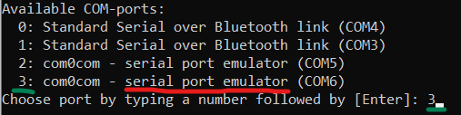

# Getting Started with the Dobot 


<br/>

## Connecting the DoBot
 The Dobot magician, which we have at Fontys is a fun and easy to use robot. It can communicate with serial to your windows laptop, which has the drivers already pre-included. That means that u simply need to power it, connect it and send some commands. 
 
First, to power the DoBot you need to make sure it is connected to the power grid. If not, you need to plug its power adapter into the power port on the back of the device. 


After that is complete, you can press the power button in the base of the Dobot, which should light up, and after a second should produce a beep, signalizing that it is on. After that, you can connect the DoBot to your laptop using the USB port on the back. 

Before doing any operations, the program controlling the DoBot will have to execute homing sequence, which will allow the DoBot to know its current position. During homing, the dobot will attempt to rotate clockwise to its right-most point. That is why, before you start using the DoBot, you should ensure, that the end of the arm is in the air and can rotate without catching on anything. If that is not the case, you can freely move the arm around by pressing and holding the button on top of the DoBot’s outermost segment. 


<br/>

## Setting up the DoBot library
In order to use the DoBot with python in windows you need to download a Dobot library from this repository. Once you open the page, you can click on the Code->Download Zip button and unzip it in a new folder. 

You should additionally install the pyserial library using pip, so you can more easily identify COM ports.
```
$ pip install pyserial
```

Even after completing this step, it is possible that Visual Studio code complains that you are missing the serial.tools package. This problem is caused by Visual Studio code trying to setup isolated environment for each of its projects, which is in most cases not required and causes similar problem. To fix that you need to go your python settings (Last row on the menu on the left), right click on the “Microsoft” option and select the “Use as Active Workspace Interpreter”. That will instruct Visual Studio code to use your system interpreter.


Once you have everything set up, to verify that everything is working correctly, you can open the main.py file in Visual Studio and run it. You will be prompted to select the index of the  DoBot from a list of the connected COM devices. The DoBot should be called something like “Silicon labs CP210X....”.



If the script runs with no errors, you should see the Dobot executing a homing sequence and doing some back and forward movements after a short wait.

<br/>

## Writing your own program
A good way to start writing your own code is to edit the provided example and so we will go through what the DoBot functions in there do, as well as some additional functions.

Before using the DoBot, we first need to connect import the library:

```python
import DoBotArm as Dbt
```
After that, we need an object that represents our DoBot and through which we can send our commands. 

```python
homeX, homeY, homeZ = 250, 0, 50
ctrlDobot = Dbt.DoBotArm(“COM1”, homeX, homeY, homeZ)
```
The homeX, homeY and homeZ determine in what position the DoBot will end up after homing, and port shows to where the DoBot is connected.  The DoBot will then automatically home.

We can now use our Dobot object for sending further commands:

<br/>

Performing <b>movements</b> with the library can be done in one of several ways:

```python
ctrlBot.moveArmXY(x, y)
```
Moves the Dobot parallel to the ground to a given coordinate. The height at which the DoBot moves is the homing height 

<br/>

```python
ctrlBot.moveArmXYRel(relx, rely)
```
Moves the Dobot parallel to the ground relative to current position.

<br/>

```python
ctrlBot.moveArmXYZ(x, y, z)
```
Moves the Dobot to a given 3-dimensional coordinate.

If ```None``` is given as a value for any of the current coordinates, the DoBot will keep that coordinate at its current value. 

<br/>

```python
ctrlBot.moveArmXYZRel(relx, rely, relz)
```
Moves the DoBot in 3 dimensions relative to the current position.

<br/>

Movement, by default is performed in linear fashion. The DoBot however supports a “Jump”, which performs a jump-like motion. The benefit of using this mode of movement is that the DoBot will avoid any error points along the way, and will complete the movement as long as the end destination is reachable. 
<br/>
The library also offers a function for easier <b>picking</b>. The function ```pickToggle(item_Height)``` will go down to a given height and remember that a picking is performed. Calling the function, a second time after a pick has been performed, the DoBot will go back to the homeZ level. 

Suction can be toggled by ```toggleSuction()```

<br/>

Note that every so far function has a <b>“Wait”</b> parameter, which is by default set to True and can be set like this:

```python
ctrlBot.moveArmXYZ(x, y, z, wait = False)
```
will prevent the function from waiting for the DoBot to complete the movement, which allows for asynchronous operations (multiple things at the same time).

 If at any point in the program you need to wait for the entire queue, or part of it to finish, you can do it as follows:
 
```python
ctrlBot.commandDelay()
```
This function will wait until the last scheduled operation on the DoBot finishes. 

<br/>

The function can also wait up to a point in the queue. To do that, you need to record the index of the operation, until which you want to wait. 
```python
index = ctrlBot.moveArmXYZ(220, 0, 50, wait = False)
#
# Other operations 
#
ctrlBot.commandDelay(index)
```

<br/>

<b>Some other useful functions and options are:</b>

```python
ctrlBot.RotateHead(6, wait = True)
```
Will rotate the held object. 

<br/>

```python
ctrlBot.SetConveyor(enabled = True, speed = 20000)
```
Will enable the connected conveyor belt. 

<br/>

```python
ctrlDobot = Dbt.DoBotArm(“COM1”, 220, 0, 50, homingWait = False)
#
# More Setup 
#
ctrlDobot.wait_rehoming()
```
Can be used to perform asynchronous initial homing. Useful when additional setup is required. 
